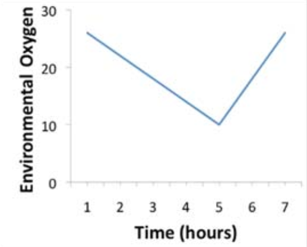
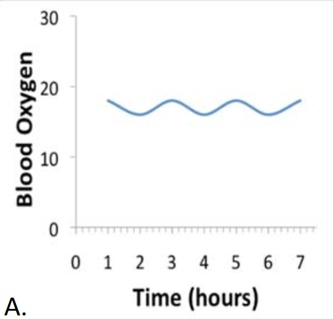
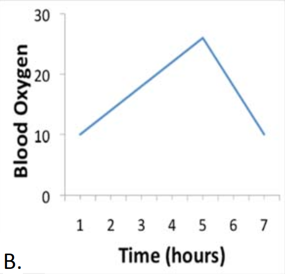
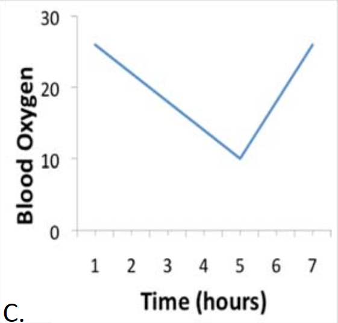

# HCI

The set of HCI datasets (McFarland et al., 2017) contains real datasets originally available in the `ShinyItemAnalysis` package (Martinková & Drabinová, 2018). The `HCItest` dataset consists of the responses of 651 students (405 males, 246 females) to Homeostasis Concept Inventory (HCI) multiple-choice test . It contains 20 items, vector of gender variable (`"0"` for males, `"1"` for females) and identificator whether students plan to major. The `HCI` dataset consists of the dichotomously scored responses, where correct answer is given in the `HCIkey` dataset. The `HCI` dataset also contains vector of gender variable and identificator whether students plan to major.

*** 
## Datasets and their variables
 * `HCI` - dichotomously scored HCI test
    + `Item1` - `Item20` = dichotomously scored items of the HCI test.
    + `gender` = gender of students, `"0"` for males, `"1"` for females.
    + `major` = criterion variable describing whether student plans to major in the life sciences.
 * `HCItest` - multiple-choice HCI test
    + `Item1` - `Item20` = multiple choice items of the HCI test.
    + `gender` = gender of students, `"0"` for males, `"1"` for females.
    + `major` = criterion variable describing whether student plans to major in the life sciences.
 * `HCIkey` - vector of factors representing correct answers of the HCItest dataset
 * `HCI_test_retest`
    + `ID` = identification of the student.
    + `test` = identification of the test, `"1"` for test, `"2"` for retest.
    + `Item1` - `Item20` = dichotomously scored items of the HCI test.
    + `total` = total test score of test/retest.

*** 
## Wording of the items
 * `Item1` = In organisms, like humans, homeostatic negative feedback mechanisms result in  
       A) an unfavorable, or damaging effect on the body.  
       B) a constant decrease in the regulated variable.  
       C) equilibrium among body cells and fluids.  
       **D)** maintenance of an internal variable within a ‘normal’ range of values. 

***   
A new species of deer is found in North America. Researchers establish that the concentration
of X in the blood is maintained at a relatively constant level over time, even when the animal’s
external or internal environment changes.

 * `Item2` = Some disturbance causes the concentration of X to increase. What change will occur in the
activity of a sensor that detects X? The sensory receptor will  
       A) increase its firing rate from zero to the maximum possible firing rate.  
      **B)** fire at a new rate proportional to the magnitude of X.  
       C) not change its firing rate.  
 * `Item3` = When any disturbance causes the value of X to decrease there will be a physiological
response that causes X to  
       **A)** increase back towards its normal value.  
       B) decrease still further.  
       C) stay constant at its new value.  
 * `Item4` = A homeostatic control mechanism functions to maintain the concentration of X at a relatively
constant level. This mechanism is functioning  
       A) when the concentration of X gets too high.  
       B) when the concentration of X gets too low.  
       C) when the concentration of X gets too high or too low.  
       **D)** at all concentrations of X.  
       
***
 * `Item5` = The body has a sensor that detects blood pressure, but does not have a sensor that detects
heart rate. Which of the following remains relatively constant when the internal or external
environment changes?  
       A) heart rate  
       **B)** blood pressure  
       C) both  
       D) neither  
 * `Item6` = Normal body temperature of a healthy adult is about 37 degrees C. A fever occurs when the
temperature set-point is elevated. Jasmine feels cold as she develops a fever because her
body temperature at that time is  
       A) less than 37 degrees C.  
       B) increasing above 37 degrees C.  
       **C)** less than the new set point temperature.  
 * `Item7` = A homeostatic mechanism in the human body has a control center, also called an integrator,
that is part of which organ system or systems?  
       A) the endocrine system  
       B) the nervous system  
       **C)** the endocrine system, the nervous system, or both  
 * `Item8` = Plasma calcium concentration is maintained relatively constant even when calcium intake
increases. Based on this information, one can conclude that  
       A) plasma calcium must be needed for the normal function of many cells.  
       B) the plasma calcium concentration must be controlled by the nervous system.  
       **C)** there must be a mechanism to detect the concentration of calcium in the plasma.  
 * `Item9` = Baroreceptors detect blood pressure. Blood pressure is maintained relatively constant even
when the internal or external environment changes. Under what conditions do the
baroreceptors send signals to the brain?  
       A) when blood pressure is not at its normal value.  
       B) when blood pressure is increasing.  
       C) when blood pressure is constant.  
       **D)** at all levels of blood pressure.  
 * `Item10` =  An animal lives in a habitat where oxygen levels in the environment vary over time as shown
below.  

  

  
  If oxygen level in the blood of the animal is regulated by a homeostatic mechanism, which of
the figures above correctly shows oxygen levels in the blood of the animal over time?    

  
  
  

  
  Correct answer is <b>A)</b>.  
  
 * `Item11` = While watching TV, Sam eats a 6 frosted sugar cookies. As glucose is absorbed from Sam’s
digestive tract, there is a rise in his blood glucose concentration. Blood glucose is homeostatically maintained.  Which of the following will occur FIRST? A change in the  
       **A)** activity of the sensors that monitor blood glucose.  
       B) activity of effectors that lower blood glucose.  
       C) release of hormones that change blood glucose.  
 * `Item12` = Dora walks home on a freezing winter night and starts to shiver. What determines how much
she will shiver?  
       A) her body temperature  
       B) the outside air temperature  
       C) her set point temperature  
       **D)** the difference between the set point temperature and her body temperature   
       E) the difference between outside air temperature and her body temperature  
 * `Item13` = Homeostatic systems require a sensor, a control center, also called an integrator, and an
effector. The role of the effector is to directly change the  
       **A)** value of the homeostatically regulated variable.  
       B) value of the set point.  
       C) magnitude of the signal from the sensor.  
       D) activity of the control center or integrator.  
 * `Item14` = In temperature regulation, the sweat gland is an effector that most directly causes a change in  
       **A)** body temperature.  
       B) the body’s temperature set point.  
       C) signals from the sensory receptors in the skin.  
       D) the temperature control center, also called an integrator, in the brain.  
 * `Item15` = Blood pressure is maintained relatively constant even when the internal or external
environment changes. Effectors are parts of the body that receive signals from a control
center. Which of the following is an effector in the system that maintains blood pressure?  
       A) blood volume  
       B) sensory receptors for blood pressure  
       **C)** cardiac muscle  
       D) the resistance that must be overcome for blood to flow  
 * `Item16` = The control center, also called an integrator, receives signals from the sensors that are part of
the mechanism and a set-point signal. Which of the following represents how the control
center processes these two signals?  
       **A)** (set-point signal) − (sensor signal)  
       B) (set-point signal) + (sensor signal)  
       C) (set-point signal) ⋅ (sensor signal)  
       D) (set-point signal) ÷ (sensor signal)  
 * `Item17` = Baroreceptors sense blood pressure. The baroreceptor nerves are cut so the signal from the
baroreceptors is unable to reach the cardiovascular control center. After cutting the nerves,
blood pressure will  
       A) remain constant.  
       B) decrease.  
       **C)** increase.  
       D) become equal to the set-point value.
 * `Item18` = Information from sensory receptors in homeostatic systems  
       A) determines the set point.  
       B) is sent to effectors.  
       **C)** is sent to control centers, also called an integrators.   
       D) stays in the receptor until the regulated variable changes back to normal.  
 * `Item19` = In a homeostatic system the control center, also called an integrator, receives sensory
information from receptors and  
       A) determines what the body wants.  
       B) determines the set point.  
       **C)** processes the information and controls the behavior of the effector.  
       D) transmits the sensory information unchanged to the effector.   
       E) controls the activity of the sensory receptors.  
 * `Item20` =  Samira is watching a movie and eats 3 chocolate bars. As Samira’s digestive tract absorbs the
sugar, there is an initial increase in her blood glucose. When are blood glucose sensors
signaling?  
       A) before eating  
       B) during eating  
       C) while eating and digesting the chocolate bars  
       **D)** all the time   

***
## References
Martinková, P., & Drabinová, A. (2018). ShinyItemAnalysis for teaching psychometrics and to enforce routine analysis of educational tests. The R Journal, 10(2), 503-515, [doi: 10.32614/RJ-2018-074](https://doi.org/10.32614/RJ-2018-074).
  
McFarland, J. L., Price, R. M., Wenderoth, M. P., Martinková, P., Cliff, W., Michael, J., ... & Wright, A. (2017). Development and validation of the homeostasis concept inventory. CBE-Life Sciences Education, 16(2), ar35, [doi: 10.1187/cbe.16-10-0305](https://doi.org/10.1187/cbe.16-10-0305).
